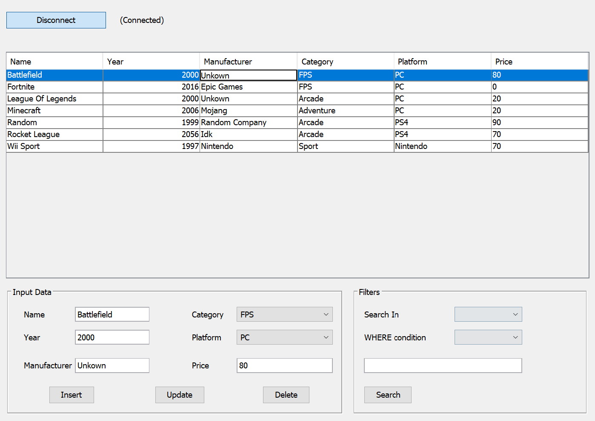

# Video Games DB JTable
A simple project based on a Video games DB in SQL lite that allows you to make CRUD operations.

## Getting started
- Download and install Java Development Kit

## Tools used
- Apache NetBeans IDE 12.6
- JDK 16
- Driver sqlite-jdbc-3.36.0.3.jar

## About the project

